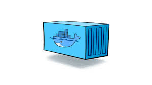

# Dockerとは
- **コンテナ仮想化技術**を使って、アプリケーションを開発・配置・実行するための隔離された環境を提供するツール

- コンテナとは
    - パソコンやサーバー上で隔離され、干渉されない環境
    
    - コンテナの中にはソフトウェアであればなんでも入れられる
        - 例：MySQL・Ubuntu Linux・Python
    - コンテナ単体では動くことができず、**ホストOS**と言われる物理的なPCが必要
    - コンテナとホストOSの間にあるのがDocker
    - ホストOSとコンテナは干渉することはないため、ホストOSがWindowでもMacOSでもコンテナの環境は変わらない
    - コンテナは、１つのホストOSに対して**複数**を持つことができる
    - 異なるホストOSでも同じコンテナを再現することができる