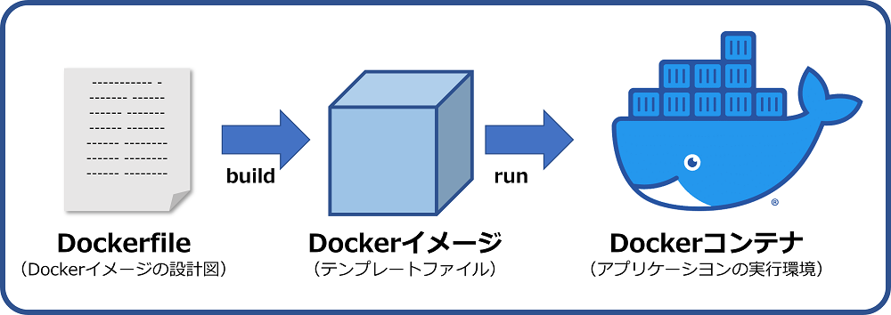

# イメージ
## イメージとは
- イメージは、コンテナに必要なソフトウェア・環境変数・設定などの情報が入っている。
- イメージはコンテナの型になるもの


## イメージの特徴
- イメージは変更不可な静的なテンプレート
- どの環境で実行しても同じコンテナ環境が再現される
- 持ち運びが可能

## イメージとコンテナのライフサイクル
- dockerのイメージの作成方法
    - [docker hub](https://hub.docker.com/)のようなイメージレジストリから作成
    - Dockerfileから作成

## コンテナのステータス
- created：作成しただけの状態
- up：起動した状態。コマンドを実行できる状態。
- exited：実行したいコマンドを終了した状態。

## dockerのイメージを操作する
- 詳しいコマンドはexample.shを参照
- ローカルにあるイメージを参照する際に以下のコマンドを打つ。
    ```sh
    docker image ls
    ```
    - そうすると以下のように表示される
    ```
    REPOSITORY              TAG       IMAGE ID       CREATED         SIZE

    sail-8.2/app            latest    c97a2860f9a4   2 weeks ago     1.68GB
    ```
    - REPOSITORYは、イメージ名
    - TAGは、イメージのバージョン
    - IMAGE IDは、イメージのID
    - CREATEDは、イメージが作成された日時
    - SIZEは、イメージの大きさ

- ローカルで存在するコンテナをい参照する際に以下のコマンドを打つ
    ```sh
    docker container ls -a
    ```

    ```
    CONTAINER ID   IMAGE                    COMMAND                   CREATED       STATUS                        PORTS                                                      NAMES
    c09e3b2f19de   phpmyadmin/phpmyadmin    "/docker-entrypoint.…"   2 weeks ago   Exited (255) 6 days ago       0.0.0.0:8888->80/tcp                                       e-jinja-phpmyadmin-1
    ```
    