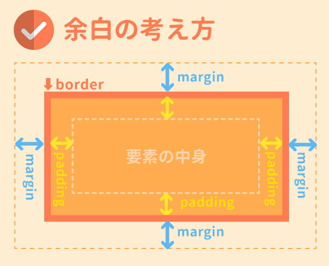

# CSSの基本
## CSSとは
- 文章の見た目を装飾するための言語
- 拡張子は、「.css」

---

## CSSを適用する方法

- CSSを適用する方法は以下の3つがあります:
    1. `<head>`タグに、`<link rel="stylesheet" href="CSSファイルのパス">` を記載する。
    2. `<head>`タグ内に`<style>`タグを使用して直接記述する。
    3. HTMLのタグ内に`style`属性を追加して記述する。

---

## CSSの基本の書き方
```css
h1 {
    color: red;
}
```
- 要素の説明
    - セレクター：どの部分を装飾するのかを書く
        - 上の例だと `h1` にあたり、波括弧の直前で指定する。
    - プロパティ：何を変えるのかを書く
        - 上の例だと`color`にあたる
    - 値：見た目をどのように変えるのかを書く
        - 上の例だと`red`にあたる

- CSSを書く時のルール
    - 半角英数字で書く
    - なるべく小文字で書く
    - 複数のセレクターに指定する
        ```css
        h1,h2,p {
            color: red;
        }
        ```
    - 複数の装飾を指定する
        ```css
        h1 {
            color: red;
            font-size: 12px;
        }
        ```
    - 単位を指定する
        - 絶対値
            - px(ピクセル)：画面上の最小単位
        - 相対値
            - %(パーセント)：親要素のサイズを基準に割合で指定する単位
            - rem(レム)：ルート要素(HTML要素)に指定されたサイズを基準とした単位

---

## 文字や文章を装飾しよう
- 文字のサイズは14-18pxが一般的
- 文字のサイズのバリエーションは2-5種類が妥当
- ジャンプ率(見出しと本文の文字サイズの比率)を考える
- fontの種類は`font-family`プロパティを使う
    - 明朝体
    - ゴシック体
    - 装飾系フォント
- フォントの種類は1-3種類に留めるのが良い
- 文字の太さを変えるなら`font-weight`を使う
値は、`normal`(標準)・`bold`(太字)・`lighter`(一段階細く)・`bolder`(一段階太く)あるいは1-1000の数字で選択する
- 長文に太文字を使わない
- 行の高さを変えるならば、`line-height`を使う
- 文章を揃えるならば、`text-align`を使う。
値は`left`(左揃え)・`right`(右揃え)・`center`(中央揃え)・`justify`(両端揃え)
- 中央揃えは短文に使う

---

## Webフォントを使おう
- Googleフォントの実装方法
    - Googleフォントを使用するには、以下の`<link>`タグを`<head>`タグ内に追加します:

    ```html
    <link href="https://fonts.googleapis.com/css2?family=Roboto&display=swap" rel="stylesheet">
    ```
    - CSSのフォントを記述する
    ```css
    body {
        font-family: 'Roboto', sans-serif;
    }
    ```

## 色をつけよう
- 色の指定方法は3種類ある
    1. カラーコード(6桁の英数字)を指定する。一般的な方法。16進数(0-9,a-f)を角桁に入れる
    2. RGBA値で指定する。最初の３桁はredとgreenとblueを0-255から指定する。(255,255,255)は白、(0,0,0)は黒である。透明度を４つ目に入れられる。最大値は1、最小値は0である。
    3. 色の名前を入れる。(red,orange,gold等)
    　　
- 背景色を指定する場合は、`background-color`を使うことができる

## 上手に配色しよう
- 色の要素は３種類ある
    - 色相：言葉で区別される色の違い
    - 明度：色の明るさ
    - 彩度：色の鮮やかさの度合い
- 色の持つ印象がある
    - 温度(暖かい・冷たい)
    - イメージ(生命力・自然・真面目・高貴等)
    - トーン(明度と彩度を合わせた概念)：薄い・浅い・明るい・強い
- 色の比率が大事
    - 「ベースカラー」(70%)：デザインの基盤の色
    - 「メインカラー」(25%)：デザインで最も見てほしい色
    - 「アクセントカラー」(5%)：デザインを引き締め、メリハリをつける色

---

## 背景を彩ろう
```css
body {
    background-image: url('background.jpg'); /* 画像のパス */
    background-repeat: no-repeat;           /* 画像の繰り返し設定 */
    background-size: cover;                /* 画像を全体に広げて表示 */
    background-position: center center;    /* 画像の位置を中央に設定 */
}
```
- 写真素材をダウンロードできるWebサイト
    - 無料のサイト
        - ぱくたそ
        - GIRLY DROP
        - StockSnap.io
        - Pixabay
    - 有料のサイト
        - iStock
        - Adobe Stock
        - PIXTA

---

## 幅と高さを指定する
```css
.box {
    width: 200px;    /* 幅を200pxに指定 */
    height: 150px;   /* 高さを150pxに指定 */
}
```
- 幅と高さを指定する単位
    - 相対単位
        - %：親要素を基準(100%)とした単位
        - em：親要素のサイズが(1em)を基準にした単位
        - rem：ルートタグのサイズを基準(1rem)とする
        - vw：ブラウザの幅を基準(100vw)とした単位
        - vh:ブラウザの高さを基準(100vh)とした割合
    - 絶対単位
        - px

---

## 余白を調整しよう
- 余白の種類(※画像参照)
    - margin
    - padding
- 外の枠線を`border`という(※画像参照)


```css
- margin(padding) 10px(上) 5px(右)　15px(下) 20px(左)
- margin(padding) 10px(上) 5px(左右) 5px(下)
- margin(padding) 10px(上下) 5px(左右)
- margin(padding) 10px(上下左右)
```
- CSSのコメントの書き方
```css
/* コメントをこうやって書ける */
```

--- 

## 線を引こう
- borderの種類
```css
.solid {
    border: 2px solid black;    /* 実線のボーダー */
}

.dashed {
    border: 2px dashed black;   /* 破線のボーダー */
}

.dotted {
    border: 2px dotted black;   /* 点線のボーダー */
}

.double {
    border: 4px double black;   /* 2重線のボーダー */
}

.groove {
    border: 4px groove black;   /* 浮き彫り効果のボーダー */
}

.ridge {
    border: 4px ridge black;    /* 盛り上がった効果のボーダー */
}

.inset {
    border: 4px inset black;    /* 押し込まれた効果のボーダー */
}

.outset {
    border: 4px outset black;   /* 飛び出した効果のボーダー */
}

.none {
    border: none;               /* ボーダーなし */
}
```

--- 

## リストを装飾しよう

```css
.disc {
    list-style-type: disc; /* デフォルトの黒丸 */
}

/* 円形のスタイル */
.circle {
    list-style-type: circle; /* 空心円 */
}

/* 四角形のスタイル */
.square {
    list-style-type: square; /* 四角形 */
}

/* 数字のスタイル */
.decimal {
    list-style-type: decimal; /* 1, 2, 3...の番号 */
}

/* ローマ数字のスタイル */
.roman {
    list-style-type: upper-roman; /* I, II, III... */
}

/* アルファベットのスタイル */
.alpha {
    list-style-type: lower-alpha; /* a, b, c... */
}
```

--- 

## クラスとIDを使った指定方法
- IDとクラスの違い
    - 同名のid名は各HTMLで１つだけ
    - 同名のclass名は使い回し可能
```html
<!DOCTYPE html>
<html lang="en">
<head>
    <meta charset="UTF-8">
    <meta name="viewport" content="width=device-width, initial-scale=1.0">
    <title>クラスとIDの違い</title>
    <style>
        /* IDのスタイル (一意の要素に適用) */
        #unique-box {
            background-color: lightblue; /* 背景色を水色に設定 */
            color: black;               /* テキストの色を黒に設定 */
            width: 200px;               /* 幅を200pxに設定 */
            padding: 10px;              /* 内側の余白 */
            border: 2px solid blue;     /* 青い境界線 */
        }

        /* クラスのスタイル (複数の要素に適用可能) */
        .common-box {
            background-color: lightgreen; /* 背景色を薄緑に設定 */
            color: black;                 /* テキストの色を黒に設定 */
            width: 200px;                 /* 幅を200pxに設定 */
            padding: 10px;                /* 内側の余白 */
            border: 2px solid green;      /* 緑の境界線 */
            margin: 5px 0;                /* 上下に余白を追加 */
        }
    </style>
</head>
<body>
    <h1>クラスとIDの違い</h1>

    <!-- IDを使用した要素 (一意のスタイル) -->
    <div id="unique-box">
        IDでスタイルを適用
    </div>

    <!-- クラスを使用した要素 (複数の要素に適用可能) -->
    <div class="common-box">
        クラスでスタイルを適用 (1)
    </div>
    <div class="common-box">
        クラスでスタイルを適用 (2)
    </div>

    <!-- クラスとIDを併用 -->
    <div id="unique-box" class="common-box">
        クラスとIDを併用
    </div>
</body>
</html>
```

---

## レイアウトの構成を考えよう

- レイアウトを設計する際には、以下の要素を考慮します:
    - コンテナ（全体の枠）
    - アイテム（中に配置する要素）
    - 順序や配置
    - レスポンシブデザイン

---

## Flexboxを使ってレイアウトを構築しよう
- Flexboxは複雑なレイアウトも簡単に組むことができる書き方

- Flexboxの基本的な書き方
    - flexコンテナ(親要素)とflexアイテム(子要素)の２種類がある

    ```html
    <style>
        .item {
            background: #0bd;
            color: #fff;
            margin: 10px;
            padding: 10px;
        }
    </style>
    <body>
        <div class="container"> <!-- flexコンテナ(親要素) -->
            <div class="item">Item 1</div> <!-- flexアイテム(子要素) -->
            <div class="item">Item 2</div> <!-- flexアイテム(子要素) -->
            <div class="item">Item 3</div> <!-- flexアイテム(子要素) -->
            <div class="item">Item 4</div> <!-- flexアイテム(子要素) -->
        </div>
    </body>
    ```
    上の状態だと縦にItemが４つ並ぶことになるが、ここに

    ```css
        . container {
            display: flex;
        }
    ```
    を入れると、横並びになる。

    - また、`flex-direction`でレイアウトを変えることができる。
    ```css
        flex-direction:row; /* 子要素を左から右に配置 */
        flex-direction:row-reserve; /* 子要素を右から左に配置 */
        flex-direction:column; /* 子要素を上から下に配置 */
        flex-direction:column-reserve; /* 子要素を下から上に配置 */
    ```

    - また、`flex-wrap`でレイアウトを変えることができる
    ```css
        flex-wrap: nowrap; /* 子要素を折り返しせずに一行に並べる */
        flex-wrap: wrap; /* 子要素を折り返しして複数行に上から下へ並べる */
        flex-wrap: wrap-reverse; /* 子要素を折り返しして複数行に下から上へ並べる */
    ```

    - 水平方向を揃える時には、`justify-content`を使うことができる。
    ```css
        justify-content: flex-start; /* 行の開始位置から左揃え */
        justify-content: flex-end; /* 行の開始位置から右揃え */
        justify-content: center; /* 中央揃え*/
        justify-content: space-between; /* 最初と最後の要素を両端に配置して、残りは均等に配置 */
        justify-content: space-around; /* 最初と最後の要素も含めて均等に配置 */
    ```

    - 垂直方向に揃える時には、`align-item`を使う
    ```css
        align-item: stretch; /* 親要素ないしはコンテンツの一番多い高さに合わせて広げて配置 */
        align-item: flex-start; /* 親要素の開始位置から配置。上揃え */
        align-item: flex-end; /* 親要素の開始位置から配置。下揃え */
        align-item: center; /* 中央揃え */
        align-item: baseline; /* ベースラインで揃える */
    ```

    - 複数行を揃える時には、`align-content`プロパティを使う
    ```css
        align-content: stretch; /* 親要素の高さに合わせて広げて配置 */
        align-content: flex-start; /* 親要素の開始位置から配置。上揃え */
        align-content: flex-end; /* 親要素の開始位置から配置。下揃え */
        align-content: center; /* 中央揃え */
        align-content: space-between; /* 最初と最後の子要素を上下の端に配置し、残り要素は均等に配置 */
        align-content: space-around; /* 上下端にある子要素も含め、均等に間隔を空けて配置 */
    ```

---

## CSSグリッドでタイル型に並べよう

- flexboxと同様に親要素と子要素がある。
```html
<html>
    <style>
        .container {
            display: grid;
        }

        .item {
            background: #0bd;
            color: #fff;
            padding: 10px;
        }
    </style>
    <body>
        <div class="container"> <!--親要素-->
            <div class="item">Item 1</div> <!--子要素-->
            <div class="item">Item 2</div> <!--子要素-->
            <div class="item">Item 3</div> <!--子要素-->
            <div class="item">Item 4</div> <!--子要素-->
            <div class="item">Item 5</div> <!--子要素-->
            <div class="item">Item 6</div> <!--子要素-->
        </div>
    </body>
</html>
```

ここに、子要素の横幅を揃える`grid-template-columns`プロパティがある。
```css
    grid-template-columns: 200px 200px 200px;
```
上記の場合は、`200px`ずつ３つずつの横並びとなる。
また、
```css
    gap:10px;
```
で、要素の幅を10pxずつ空けることができる。

また、gridで使える単位として「`fr`」がある。
例えば、
```css
    grid-template-columns: 1fr 1fr 1fr;
```
とした場合は、1：1：1で３つずつの配置ができる。

また、子要素の高さを指定する場合は、`grid-template-rows`がある。
```css
    grid-template-rows: 200px 200px /* 1行目も2行目も高さは200pxということ*/
```

--- 

## 読みやすいレイアウト
- 視線の流れは２種類ある。
    - Z型
    - F型

- 配置する順番や面積を考える

---

## リセットCSS
- ブラウザによって、デフォルトのCSSが違う
- そのため、リセットCSSを読み込ませるとブラウザごとの差異がなくなる
``` html
<head>
    <link rel="stylesheet" href= "https;//unpkg.com/ress/dist/ress.min.css"> <!-- リセットCSS(必ず自作のCSSより上に持っていく -->
    <link rel="stylesheet" href= "自作のCSSのパス">
<head>
```