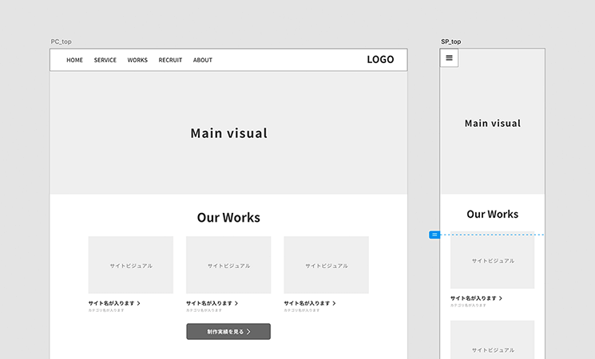

# 最初に知っておこう！ Webサイトの基本

## よいWebデザインとは
1. デザインの目的は、相手に**伝えること**であり、**美しく装飾すること**ではない。  
2. **使いやすいこと**が大事であり、目的の情報がどこに書いてあるか分からなかったり、内容が理解できないとWebサイトから離れてしまう。  
3. より良い**生活を提供すること**が大事。デザインは問題解決の手段であり、ユーザーが心地よく目的を達成することができるためのツールである。

---

## 様々な種類のWebサイト
1. **コーポレートサイト**  
   - 会社の概要や自社製品、採用情報が載っている企業について情報発信するWebサイト  
   - **目的**:
     - 自社製品を紹介したい
     - ライバル社との違いを説明したい
     - 優秀な人材を社員として迎え入れたい

2. **プロモーションサイト**  
   - 特定の商品やサービス、イベントの告知を行うサイト  
   - **目的**:
     - 期間限定のイベントを告知したい
     - 新たにスタートしたサービスを広めたい
     - お問い合わせの数を増やしたい

3. **ポートフォリオサイト**  
   - 主にデザイナーやアーティスト、フォトグラファーが**自身の作品や制作実績を掲載**しているWebサイト  
   - **目的**:
     - これまで作った作品を見てもらいたい
     - 就職活動で自分のスキルを紹介したい
     - 新規案件を受注したい

4. **ショッピングサイト**  
   - インターネット上で商品を販売するサイトで、**ECサイト**や**オンラインストアサイト**とも言われる。  
   - **目的**:
     - 商品をオンラインで販売したい
     - 自作の楽曲をダウンロード販売したい
     - 実店舗の商品を海外展開したい

5. **メディアサイト**  
   - ニュースや読み物記事で構成されるサイト  
   - **目的**:
     - 自社のサービスの情報を提供したい
     - 広告で収入を得たい
     - 自分の考えを伝えたい

6. **SNS**  
   - ユーザーとリアルタイムでコミュニケーションが取りやすく、**情報を拡散しやすい**という特徴がある  
   - **目的**:
     - ユーザーに**親近感**を持ってもらいたい
     - ユーザーと直接コミュニケーションを取りたい
     - リアルタイムでサポートしたい

---

## ユーザビリティとは
1. **使いやすさを考える**  
   - Webサイトの機能を簡単に使えて、**使っていてストレス**がない  
   - 実際にWebサイトに訪れた**ユーザーの視点**になって制作することが大切  

2. **見やすいデザインにする**  
   - **色使い**に注意する（特に背景色と文字色のコントラスト）  
   - **目立たせたいもの**を明確にする  
   - レイアウトを**統一**する  

3. **読みやすい文章にする**  
   - **結論**を先に書く  
   - **専門用語**は使わない（Webのメインターゲット層を考える）  
   - **簡潔に**まとめる  

4. **使いやすい操作性にする**  
   - **動作を速く**する（大きな画像や動画はファイルサイズを小さくする工夫が必要）  
   - **一目見て**分かるようにする  

---

## Webサイトの仕組み

### インターネットとは
- 世界中のコンピューター同士で色々な情報を交換できる仕組み

### Webとは
- "**World Wide Web**"の略で、インターネットの仕組みを利用してWebサイトから情報を発信したり、閲覧できる仕組み

### Webページの仕組み
- Webページを閲覧するために必要なもの: **Webサーバー**と**Webクライアント**  
  - **Webサーバー**: ファイルを保存するコンピューター  
  - **Webクライアント**: 私たちが使うコンピューター 

### URLとは
- **URL**は、閲覧したいWebサイトにたどり着くための住所のようなものです。  
- **ハイパーリンク**は、テキストや画像にURLの情報を埋め込み、それをクリックすることで別ページを表示する仕組みです。

    以下のURLはWebページへのパスを示しています:

    ```plaintext
    http://example.com/sample/index.html
    ```
    このURLの構成要素は以下の通りです:

    - **http**: プロトコル  
    - Webサイトにアクセスする際に使用する通信規約（例: HTTPやHTTPS）。

    - **example.com**: ドメイン名  
    - サイトが公開されているサーバーの住所。

    - **/sample/**: フォルダ名  
    - サーバー内の特定のフォルダを指定するパス。

    - **index.html**: ファイル名  
    - 表示される具体的なWebページ（HTMLファイル）。
        
---


## デバイスの種類
- **IOSデバイス**: Appleが開発したiOSを使ったデバイス（例: iPhone, iPad）  
- **Androidデバイス**: Googleが開発したAndroid OSを使ったデバイス（例: Xperia, Galaxy）  
- **モバイルデバイス**: 携帯して持ち運びができるデバイス  
- **スマートデバイス**: インターネット接続でアプリが利用できる端末  
- **ウェアラブルデバイス**: メガネや時計、指輪などに身につけられるデバイス  
- **IoTデバイス**: "Internet of Things"の略で、インターネットを搭載した身の回りのもの  

---

## ブラウザーの種類
- Google Chrome  
- Safari  
- Microsoft Edge  
- Firefox  

---

## 制作の流れ
1. **企画を立てる**  
    - **目標を設定する**  
    - メインゴール: 商品の売り上げを伸ばす、資料を請求してもらうなど  
    - サブゴール: 商品の特徴を知ってもらう、会員登録をしてもらうなど  
    - **ターゲットユーザーを決める**  
    - 性別、年齢層、職業、趣味、悩み、収入など  

2. **サイトマップを作る**  
    - ページ同士のつながりや重要度の構成を図にまとめる  

3. **ワイヤーフレームを作る**  
    - デザインの枠組みを作る  
    - **ワイヤーフレーム作成ツール**: Figma, Adobe Illustrator など
     

4. **デザインをする**  
    - デザインカンプを作成  
    

5. **コーディングをする**  
    - HTML、CSS、画像ファイルを用意する  

6. **Web上に公開する**  
    - サーバーを用意する（例: ロリポップ、さくらインターネット）  
    - ドメインを取得する（例: お名前.com）  


