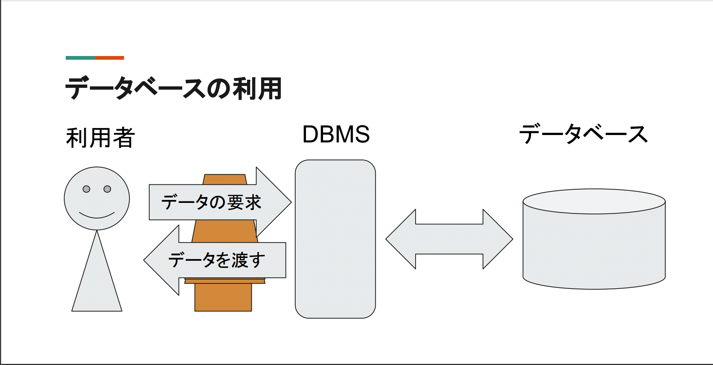
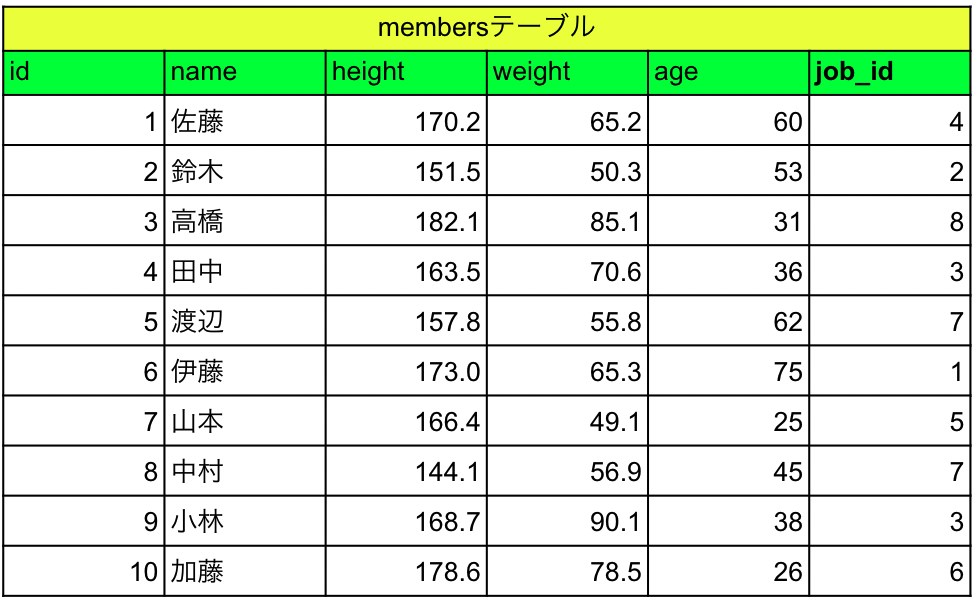
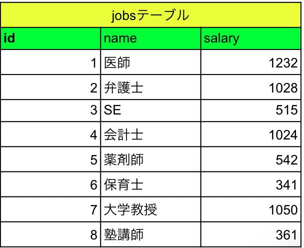

# DB・SQLとは
---
## データベース

- **データベースとは**
    - **大量の情報**を保存し、コンピュータから効率よくアクセスできるように整理したデータの集まり
    - 言葉の由来は、第二次世界大戦の米軍(そこに行けば全ての情報が得られた)

---

- **データベースの用途**
    - **ECサイト**やSNSなどのシステムのほとんど全て
    - ちなみにExcelで管理しようとすると、**大人数で共有できない**ことや**セキュリティや事故に弱い**等がある

---

- **DBMS**
    - データを蓄積するデータベースを管理するのがDBMS。
    - 利用者がDBMSにデータを要求してDBMSがデータベースからデータを取ってきて、利用者に渡す
    

---

- **データベースの種類**
    - **リレーショナルデータベース**
        - 主流
        - Excelのように列と行からなるテーブルがある
        - ２次元表のようなデータを管理
        - 以下の例の場合は、佐藤さんの職業がjobsテーブルから「**会計士**」と分かる
        - ２つのテーブルから情報を読み取れるような構造を**リレーショナルデータベース**という
        
        
    - 階層型データベース
    - オブジェクト指向データベース
    - キー・バリュー型データストア

---

- **RDBMSとは**
    - RDBを管理するシステムを**RDBMS**という
    - RDBMSの代表例
        - Oracle Database(Oracle社)
        - SQL Server(Microsoft社)
        - PostgreSQL(オープンソース)
        - MySQL(オープンソース)

---

- **SQLとは**
    - RDBMSをコントロールする言語

---

- **データ分析の全体感**
    1. 仮説を立てる
    2. **データを集める**←この時にDB・SQLが重要
    3. **データを分析する**←この時にDB・SQLが重要
    4. 新たな仮説を得たり意思決定をしたりする

---

- **言葉の定義**
    - 列：**カラム**
    - セル：**フィールド**
    - 行：**レコード**

---

- **データ分析をする使い分け**
    - SQL：データ分析で使用するデータを、データベースから用意するまで
    - R：その場限りの分析の場合
    - Python：処理をシステム化したり、機械学習を用いた分析の場合

---

- **SQLの３つの機能**
    1. データ操作
        - データの登録・修正・削除・検索・結合
    2. データ定義
        - データ構造の定義
    3. データ制御
        - データベースのアクセス制御
    
---

- **データ操作の構成要素**
    - SELECT：データを抽出する
        - SELECT文で必要なデータを取り出すことを、**問い合わせ**(**クエリ**)という
    - INSERT：テーブルにレコードを追加する
    - UPDATE：テーブルの中にあるレコードのデータの内容を更新する
    - DELET：テーブルのレコードを削除する