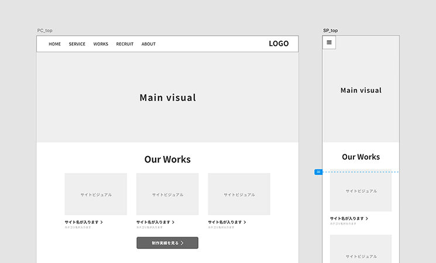
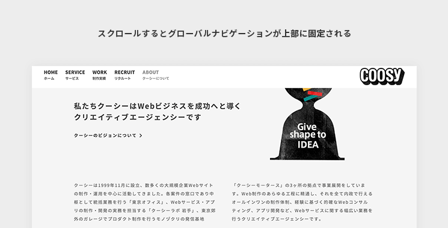

# 最初に知っておこう！ Webサイトの基本
## よいWebデザインとは
1. デザインの目的は、相手に**伝えること**であり、**美しく装飾すること**ではない。 
2. **使いやすいこと**が大事であり、目的の情報がどこに書いてあるか分からなかったり、内容が理解できないとWebサイトから離れてしまう。 
3. より良い**生活を提供すること**が大事。デザインは問題解決の手段であり、ユーザーが心地よく目的を達成することができるためのツールである。

## 様々な種類のWebサイト
1. **コーポレートサイト**
    - 会社の概要や自社製品、採用情報が載っている企業について情報発信するWebサイト
    - 目的は、以下の３つ
        - 自社製品を紹介したい
        - ライバル者との違いを説明したい
        - 優秀な人材を社員として迎え入れたい
         

2. **プロモーションサイト**
    - 特定の商品やサービス、イベントの告知を行うサイト
    - 目的は、
        - 期間限定のイベントを告知したい
        - 新たにスタートしたサービスを広めたい
        - お問い合わせの数を増やしたい
         

3. **ポートフォリオサイト**
    - 主にデザイナーやアーティスト、フォトグラファーが**自身の作品や制作実績を掲載**しているWebサイト
    - 目的は、
        - これまで作った作品を見てもらいたい
        - 就職活動で自分のスキルを紹介したい
        - 新規案件を受注したい
         

4. **ショッピングサイト**
    -インターネット上で商品を販売するサイトで、**ECサイト**や、**オンラインストアサイト**とも言われる。
    - 目的は、
        - 商品をオンラインで販売したい
        - 自作の楽曲をダウンロード販売したい
        -　実店舗の商品を海外展開したい
         
    
5. **メディアサイト**
    - メディアサイトは、ニュースや読み物記事で構成されるサイト
    - 目的は、
        - 自社のサービスの情報を提供したい
        - 広告で収入を得たい
        - 自分の考えを伝えたい
         

    
6. **SNS**
    - ユーザーとリアルタイムでコミュニケーションが取りやすく、**情報を拡散しやすい**という特徴がある
    - 目的は、
        - ユーザーに**親近感**を持ってもらいたい
        - ユーザーと直接コミュニケーションを取りたい
        - リアルタイムでサポートしたい
         

## ユーザビリティとは
1. 使いやすさを考える
    - Webサイトの機能を簡単に使えて、**使っていてストレス**がない
    - 実際にWebサイトに訪れた**ユーザーの視点**になって制作することが大切
     

2. 見やすいデザインにする
    - **色使い**に注意する(特に背景色と文字色のコントラスト)
    - **目立たせたいもの**を明確にする
    - レイアウトを**統一**する
     

3. 読みやすい文章にする
    - **結論**を先に書く
    - **専門用語**は使わない(Webのメインターゲット層はどこななのかを考えておく)
    - **簡潔に**まとめる
     

4. 使いやすい操作性にする
    - **動作を速く**する
        - 大きな画像や動画をたくさん使う場合はなるべくファイルサイズを小さくする工夫が必要
    - **一目見て**分かるようにする
     

## Webサイトの仕組み
- インターネットとは
    - 世界中のコンピューター同士で色々な情報を交換できる仕組み
     
- Webとは
    - "**World Wide Web**"の略で世界中のコンピューターと通信できるインターネットの仕組みを利用してWebサイトから情報を発信したり、閲覧できるためにできた仕組み
     

- Webページの仕組み
    - Webページを閲覧するために必要なものが、「**Webサーバー**」と「**Webクライアント**」
        - Webサーバー：コンピューターの一種でファイルを保存できるが操作できない
        - Webクライアント:私たちが使うコンピューター
     

- URLとは
    - 閲覧したいWebサイトにたどり着ける住所
    - ハイパーリンクというテキストや画像にURLの情報を配置して、それをクリックして別ページを表示する仕組み
    - 例 
        - http:(プロトコル)//example.com(ドメイン名)/sample(フォルダ名)/index(ファイル名).html(ファイル拡張子)
    
## デバイスの種類
- 端末
    - IOSデバイス：Appleが開発しているシステムである「iOS」を使ったデバイス
        - 例: iPhone, iPad
     
    - Androidデバイス：Googleが開発したAndroid OSを使ったデバイス
        - 例：Xperia,Galaxy
     
    - モバイルデバイス：携帯して持ち運びができるデバイス
     
    - スマートデバイス：インターネットで接続して、アプリケーションを利用できる端末
     
    - ウェアラブルデバイス：メガネや時計や指輪に身につけられるデバイス
     
    - IoTデバイス：「**Internet of Things**」の略でインターネットを搭載した身の回りのもの
     
- 周辺機器
    - USBデバイス：USBに対応した機器
     
    - ストレージデバイス：SDメモリやハードディスク
     
    - オーディオディスク：スピーカーやマイク、ヘッドセットなどの音声を入力したり出力したりすることのできるデバイス
     

## ブラウザーの種類
- Google Chrome
- Safari
- microsoft Edge
- Firefox

## 制作の流れ
1. 企画を立てる
    - 目標を設定する
        - メインゴールを作る
            - 商品の売り上げを伸ばす・資料を請求してもらう・作った作品を見てもらう等
        - サブゴールの例
            - 商品の特徴を知ってもらう・会員登録をしてもらう等
        - ターゲットユーザーを決める
            - 性別・年齢層・職業・趣味・悩み・収入等
     
2. サイトマップを作る
    - ページ同士のつながりや重要度の構成を図にまとめる。
    - なるべく２層以内にする
    - ページの優先順位を決める
     
3. ワイヤーフレームを作る
    - デザインの枠組みのこと
        - コンテンツの優先順位を考える(ファーストビューで何を伝えたいか)
            - メイン画像
            - ロゴ
            - ナビゲーションメニュー
            - タイトル
            - 紹介文
            - 商品写真
        - 視線の動きを考える
            - 視線は、「**上から下**」、「**左から右**」に動く
        - ワイヤーフレーム作成ツール
            - Figma
            - Cacoo
            - Moqups
            - Wireframe.cc
            - InVision
            - Adobe Illustrator
            - Sketch
            - Justinmind
        - ワイヤーフレームの例
        
         
4. デザインをする
    - デザインカンプを作る
        
         
5. コーディングをする
    - HTMLとCSSと画像ファイルを用意する
        - 画像の種類は、
            - JPG(写真やグラデーションい適している)
            - PNG(イラストやロゴに適している)
            - GIF(単色や簡単なイラストに向いている)
            - SVG(ベクター形式を採用しているため、拡大縮小しても画質が衰えない)
            - WebP(画像サイズを軽量化できる)
         
6. Web上に公開する
    - サーバーを用意する
        - ロリホップ！レンタルサーバー
        - さくらインターネット
    - ドメインを取得する
        - お名前.com
        - ムームードメイン
    - Webサーバーにファイルをアップロードする

